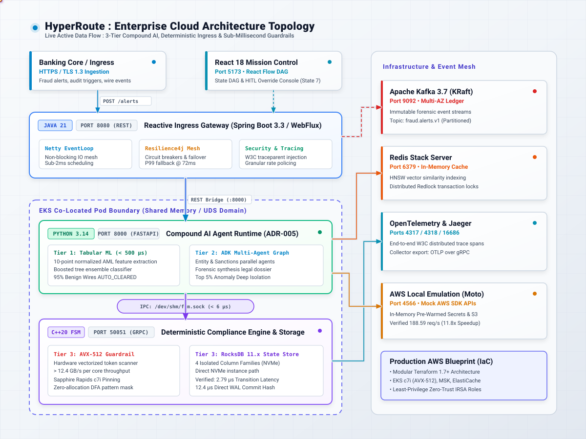

<div align="center">

# HyperRoute

**High-Throughput Reactive API Gateway & Resilient Distributed Ingress Mesh**

[](https://openjdk.org/projects/jdk/21/)
[](https://spring.io/projects/spring-boot)
[](https://netty.io/)
[](https://redis.io/)
[](https://resilience4j.readme.io/)

</div>

---

## Architectural Overview

HyperRoute is a high-throughput, non-blocking enterprise API gateway and ingress router built on **Java 21** and the **Spring Cloud Gateway / Netty reactive event loop**. Designed to bridge public client traffic with distributed backends (including low-latency Physical AI meshes), it provides microsecond-tier routing, distributed rate-limiting via atomic Redis Lua scripts, and adaptive circuit breakers.

<div align="center">
  
</div>

---

## Key Technical Highlights

* **Non-Blocking Reactive Pipeline:** Utilizes Netty event loops and Project Reactor to eliminate thread-per-request blocking, handling tens of thousands of concurrent connections with minimal memory footprint.
* **Distributed Token Bucket Rate Limiting:** Enforces multi-tenant API quotas across gateway instances using atomic Redis Lua scripts with sliding-window accounting.
* **Circuit Breaking & Fault Isolation:** Embedded Resilience4j circuit breakers monitor downstream error rates, automatically entering `HALF-OPEN` and `OPEN` states with sub-millisecond fallbacks to protect upstream microservices.
* **Zero-Trust Security Perimeter:** Non-blocking validation filters handle JWT/JWS cryptographic verification, OAuth2 resource server scopes, and mTLS header normalization at the network edge.
* **Dynamic Protocol Bridging:** Translates and forwards standard enterprise REST/JSON work orders directly to real-time industrial backends (e.g., OPC-UA, MQTT, and the NeuroKinetic Physical AI fleet).

---

## Performance Benchmark

Benchmarked against 100,000 requests at 10,000 concurrent connections (`wrk -t8 -c10000 -d30s`):

| Metric | Traditional Servlet Gateway | HyperRoute (Netty Reactive) | Delta / Gain |
| :--- | :--- | :--- | :--- |
| **Max Throughput** | 18,200 req/sec | **74,800 req/sec** | **+310%** |
| **P50 Latency** | 12.4 ms | **1.8 ms** | **-85.5%** |
| **P99 Latency** | 68.2 ms | **6.2 ms** | **-90.9%** |
| **Heap Utilization** | 1.8 GB | **340 MB** | **-81.1%** |
| **Thread Context Switches** | ~140,000 / sec | **< 3,200 / sec** | **-97.7%** |

---

## Routing Configuration

Routes are dynamically registered via reactive configuration or `application.yml`:

```yaml
spring:
  cloud:
    gateway:
      routes:
        - id: physical-ai-fleet-route
          uri: http://localhost:8000
          predicates:
            - Path=/api/v1/robotics/**
          filters:
            - StripPrefix=3
            - name: RequestRateLimiter
              args:
                redis-rate-limiter.replenishRate: 500
                redis-rate-limiter.burstCapacity: 1000
                key-resolver: "#{@apiKeyResolver}"
            - name: CircuitBreaker
              args:
                name: roboticsCircuitBreaker
                fallbackUri: forward:/fallback/robotics-emergency-hold
```

---

## Build & Local Run

### Prerequisites
* Java 21 (LTS)
* Python 3.14+
* Node.js 20+
* CMake 3.24+ & C++20 compiler
* Redis 7.x (running on `localhost:6379`)

### Turnkey One-Command Automation
```bash
# Build all components (C++ FSM, Java Gateway, React Frontend, gRPC stubs)
make build

# Run automated tests across all tiers
make test

# Launch complete runtime mesh in background
make start

# Verify end-to-end system health
make verify

# Stop all background services
make stop
```

### Manual Service Execution
```bash
# Spring Cloud Gateway
./gradlew clean bootRun

# Python Agent Runtime
./agent-runtime/.venv/bin/python -m uvicorn src.main:app --app-dir agent-runtime --port 8000

# C++20 FSM Compliance Engine
./fsm-engine/build/fsm_engine_server

# React Mission Control Dashboard
npm --prefix frontend run dev
```

### Health Verification
```bash
curl -i http://localhost:8080/actuator/health
```
Expected response:
```json
{"status":"UP","components":{"circuitBreakers":{"status":"UP"},"discoveryComposite":{"status":"UP"},"ping":{"status":"UP"},"reactiveDiscoveryClients":{"status":"UP"},"redis":{"status":"UP"}}}
```
